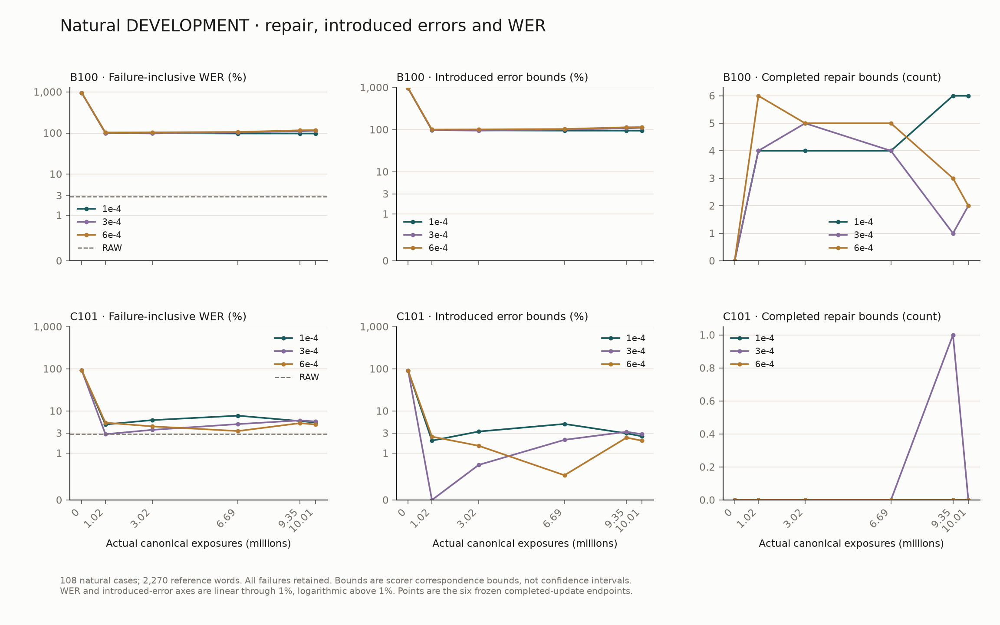
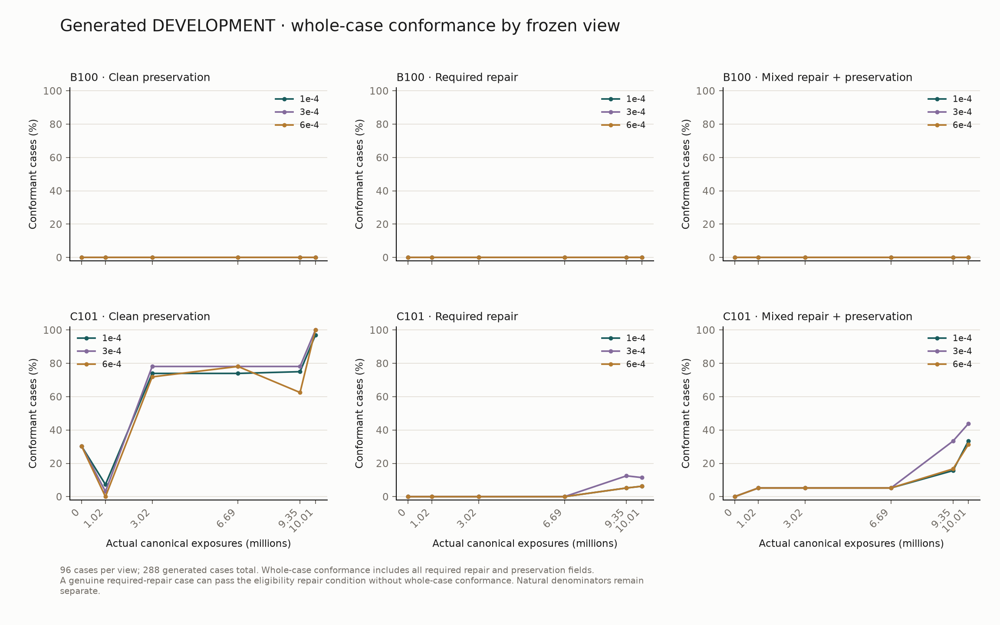
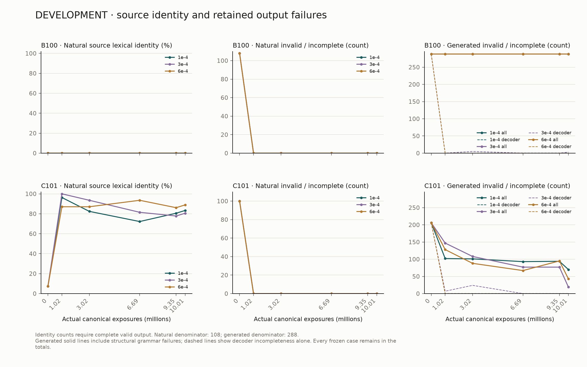

# 10M DEVELOPMENT learning curves

FACT — Campaign freeze SHA-256 `43a97ef40acbb2efebaf4941931934969c093e23f77b69bfd132f236755b1dd3`. [campaign-freeze.attempt01.json](../../experiments/manifests/six_10m_probes/campaign-freeze.attempt01.json). Endpoint decisions: [endpoint-selection.attempt01.json](../../experiments/manifests/six_10m_probes/endpoint-selection.attempt01.json). Descriptive tables and raw-output/resource hash bindings: [descriptive-tables.attempt01.json](../../experiments/manifests/six_10m_probes/descriptive-tables.attempt01.json).

FACT — Six fixed evaluation endpoints are shown below; natural and generated denominators remain separate. All invalid, capped and incomplete outputs remain included. Bounds describe scorer alignment ambiguity, not statistical uncertainty.

| Nominal exposure | Completed update | Actual exposure | Last ordinal |
| --- | --- | --- | --- |
| 0 | 0 | 0 | -1 |
| 1000000 | 31 | 1017149 | 13838 |
| 3000000 | 92 | 3018478 | 41095 |
| 6666667 | 204 | 6693230 | 91100 |
| 9333334 | 285 | 9350642 | 127234 |
| 10000000 | 305 | 10007223 | 134590 |

## B100-seed42-lr1e-04

MEASURED RESULT — Frozen evaluations, source RAW 64/2,270.

| Nominal | WER errors | WER | Completed repair | Support groups | Introduced errors | Preserved bounds (covered tokens) | Preservation covered cases /108 | Covered correct tokens /2,210 | Byte/lex identity /108 | Natural failures | Scorer caps | Natural output words |
| --- | --- | --- | --- | --- | --- | --- | --- | --- | --- | --- | --- | --- |
| 0 | 21781 | 959.515419% | 0–0 | 0 | 21719–21719 | 10–10 | 108 | 2210 | 0/0 | 108 | 0 | 20769 |
| 1000000 | 2270 | 100.000000% | 4–4 | 3 | 2210–2210 | 0–0 | 108 | 2210 | 0/0 | 0 | 0 | 188 |
| 3000000 | 2250 | 99.118943% | 4–4 | 3 | 2190–2190 | 111–112 | 108 | 2210 | 0/0 | 0 | 0 | 905 |
| 6666667 | 2216 | 97.621145% | 4–4 | 3 | 2156–2156 | 89–96 | 108 | 2210 | 0/0 | 0 | 0 | 1012 |
| 9333334 | 2213 | 97.488987% | 6–6 | 3 | 2155–2155 | 90–97 | 108 | 2210 | 0/0 | 0 | 0 | 986 |
| 10000000 | 2208 | 97.268722% | 6–6 | 3 | 2150–2150 | 91–100 | 108 | 2210 | 0/0 | 0 | 0 | 1014 |

| Nominal | Clean /96 | Mixed /96 | Required-only /96 | Whole /288 | Required repaired cases /192 | Structure failures /288 | Decoder failures /288 | Decode positions | Decode seconds |
| --- | --- | --- | --- | --- | --- | --- | --- | --- | --- |
| 0 | 0 | 0 | 0 | 0 | 0 | 288 | 288 | 101376 | 422.385795 |
| 1000000 | 0 | 0 | 0 | 0 | 0 | 288 | 0 | 9489 | 44.748118 |
| 3000000 | 0 | 0 | 0 | 0 | 0 | 288 | 0 | 12026 | 54.266282 |
| 6666667 | 0 | 0 | 0 | 0 | 0 | 288 | 0 | 12778 | 60.360661 |
| 9333334 | 0 | 0 | 0 | 0 | 0 | 288 | 0 | 12954 | 60.839366 |
| 10000000 | 0 | 0 | 0 | 0 | 0 | 288 | 0 | 13145 | 62.872234 |

| Nominal | Update | Phase | Train loss | LR | Gradient norm | Components (pre-update monitor) |
| --- | --- | --- | --- | --- | --- | --- |
| 0 | 0 | initial | unmeasured | no update | unmeasured | {} |
| 1000000 | 31 | P0 | 3.2290985465515405 | 9.846486080397198e-05 | 7.573785305023193 | {"target_EOS": 3.2290985465515405} |
| 3000000 | 92 | P0 | 1.8008463336154819 | 8.284814685084075e-05 | 1.4430230855941772 | {"target_EOS": 1.8008463336154819} |
| 6666667 | 204 | P1 | 1.0433811023831367 | 3.300285670025534e-05 | 1.9543348550796509 | {"target_EOS": 1.0433811023831367} |
| 9333334 | 285 | P2 | 2.1293567521497607 | 1.097147062382377e-05 | 17.845401763916016 | {"target_EOS": 2.1293567521497607} |
| 10000000 | 305 | P2 | 1.0558236259967089 | 1e-05 | 4.33195686340332 | {"target_EOS": 1.0558236259967089} |

DESCRIPTIVE INFERENCE — First observed positive completed natural repair lower bound: **1000000** nominal exposures. This is a repair-count onset, not viability. From P1 evaluation to 10M, natural errors changed by **-5**; the actual observation interval is 9,350,642–10,007,223 exposures. Endpoint eligibility is **FAIL**. No unregistered material-improvement threshold is applied.

## C101-seed42-lr1e-04

MEASURED RESULT — Frozen evaluations, source RAW 64/2,270.

| Nominal | WER errors | WER | Completed repair | Support groups | Introduced errors | Preserved bounds (covered tokens) | Preservation covered cases /108 | Covered correct tokens /2,210 | Byte/lex identity /108 | Natural failures | Scorer caps | Natural output words |
| --- | --- | --- | --- | --- | --- | --- | --- | --- | --- | --- | --- | --- |
| 0 | 2108 | 92.863436% | 0–0 | 0 | 2048–2048 | 162–162 | 108 | 2210 | 8/8 | 100 | 0 | 168 |
| 1000000 | 109 | 4.801762% | 0–0 | 0 | 45–45 | 2166–2166 | 108 | 2210 | 104/104 | 0 | 0 | 2227 |
| 3000000 | 138 | 6.079295% | 0–0 | 0 | 74–74 | 2137–2137 | 108 | 2210 | 86/89 | 0 | 0 | 2194 |
| 6666667 | 176 | 7.753304% | 0–0 | 0 | 112–112 | 2099–2099 | 108 | 2210 | 74/78 | 0 | 0 | 2169 |
| 9333334 | 131 | 5.770925% | 0–0 | 0 | 67–67 | 2143–2143 | 108 | 2210 | 86/87 | 0 | 0 | 2204 |
| 10000000 | 121 | 5.330396% | 0–0 | 0 | 57–57 | 2153–2153 | 108 | 2210 | 88/90 | 0 | 0 | 2214 |

| Nominal | Clean /96 | Mixed /96 | Required-only /96 | Whole /288 | Required repaired cases /192 | Structure failures /288 | Decoder failures /288 | Decode positions | Decode seconds |
| --- | --- | --- | --- | --- | --- | --- | --- | --- | --- |
| 0 | 29 | 0 | 0 | 29 | 0 | 206 | 206 | 58536 | 266.862589 |
| 1000000 | 7 | 5 | 0 | 12 | 13 | 102 | 0 | 2157 | 11.284937 |
| 3000000 | 71 | 5 | 0 | 76 | 9 | 101 | 0 | 2075 | 11.645661 |
| 6666667 | 71 | 5 | 0 | 76 | 8 | 93 | 0 | 1969 | 10.870573 |
| 9333334 | 72 | 15 | 5 | 92 | 27 | 94 | 0 | 2520 | 13.029632 |
| 10000000 | 93 | 32 | 6 | 131 | 49 | 70 | 0 | 2833 | 14.056227 |

| Nominal | Update | Phase | Train loss | LR | Gradient norm | Components (pre-update monitor) |
| --- | --- | --- | --- | --- | --- | --- |
| 0 | 0 | initial | unmeasured | no update | unmeasured | {} |
| 1000000 | 31 | P0 | 3.124110800679773 | 9.846486080397198e-05 | 13.139154434204102 | {"action": 0.22739100728835993, "end": 0.48702627333384657, "start": 0.49270312251999626, "vocabulary": 1.9167606956732037} |
| 3000000 | 92 | P0 | 0.972011668014602 | 8.284814685084075e-05 | 8.366854667663574 | {"action": 0.06258101686900587, "end": 0.06287912131435629, "start": 0.09865154848582502, "vocabulary": 0.7477986777791565} |
| 6666667 | 204 | P1 | 1.0297789313890462 | 3.300285670025534e-05 | 17.07171630859375 | {"action": 0.27569362761430427, "end": 0.2015580861233278, "start": 0.12907607522935005, "vocabulary": 0.4230620268241232} |
| 9333334 | 285 | P2 | 0.7556622509839599 | 1.097147062382377e-05 | 32.531349182128906 | {"action": 0.048719575056500944, "end": 0.0792605712679365, "start": 0.12534719675539002, "vocabulary": 0.5022620381630263} |
| 10000000 | 305 | P2 | 0.31751179979391964 | 1e-05 | 8.181965827941895 | {"action": 0.008949702584105549, "end": 0.011520056009947046, "start": 0.004749845663035238, "vocabulary": 0.2924625433030155} |

DESCRIPTIVE INFERENCE — First observed positive completed natural repair lower bound: **not observed** nominal exposures. This is a repair-count onset, not viability. From P1 evaluation to 10M, natural errors changed by **-10**; the actual observation interval is 9,350,642–10,007,223 exposures. Endpoint eligibility is **FAIL**. No unregistered material-improvement threshold is applied.

## B100-seed42-lr3e-04

MEASURED RESULT — Frozen evaluations, source RAW 64/2,270.

| Nominal | WER errors | WER | Completed repair | Support groups | Introduced errors | Preserved bounds (covered tokens) | Preservation covered cases /108 | Covered correct tokens /2,210 | Byte/lex identity /108 | Natural failures | Scorer caps | Natural output words |
| --- | --- | --- | --- | --- | --- | --- | --- | --- | --- | --- | --- | --- |
| 0 | 21781 | 959.515419% | 0–0 | 0 | 21719–21719 | 10–10 | 108 | 2210 | 0/0 | 108 | 0 | 20769 |
| 1000000 | 2270 | 100.000000% | 4–4 | 3 | 2210–2210 | 0–0 | 108 | 2210 | 0/0 | 0 | 0 | 121 |
| 3000000 | 2221 | 97.841410% | 5–5 | 4 | 2162–2162 | 62–66 | 108 | 2210 | 0/0 | 0 | 0 | 1161 |
| 6666667 | 2351 | 103.568282% | 4–4 | 4 | 2291–2291 | 107–121 | 108 | 2210 | 0/0 | 0 | 0 | 1856 |
| 9333334 | 2514 | 110.748899% | 1–1 | 1 | 2451–2451 | 79–96 | 108 | 2210 | 0/0 | 0 | 0 | 2068 |
| 10000000 | 2584 | 113.832599% | 2–2 | 2 | 2522–2522 | 121–132 | 108 | 2210 | 0/0 | 0 | 0 | 2419 |

| Nominal | Clean /96 | Mixed /96 | Required-only /96 | Whole /288 | Required repaired cases /192 | Structure failures /288 | Decoder failures /288 | Decode positions | Decode seconds |
| --- | --- | --- | --- | --- | --- | --- | --- | --- | --- |
| 0 | 0 | 0 | 0 | 0 | 0 | 288 | 288 | 101376 | 431.317245 |
| 1000000 | 0 | 0 | 0 | 0 | 0 | 288 | 0 | 11703 | 50.968971 |
| 3000000 | 0 | 0 | 0 | 0 | 0 | 288 | 5 | 14559 | 64.812544 |
| 6666667 | 0 | 0 | 0 | 0 | 0 | 288 | 0 | 14106 | 65.460765 |
| 9333334 | 0 | 0 | 0 | 0 | 0 | 288 | 0 | 15038 | 68.023923 |
| 10000000 | 0 | 0 | 0 | 0 | 0 | 288 | 3 | 18572 | 80.771583 |

| Nominal | Update | Phase | Train loss | LR | Gradient norm | Components (pre-update monitor) |
| --- | --- | --- | --- | --- | --- | --- |
| 0 | 0 | initial | unmeasured | no update | unmeasured | {} |
| 1000000 | 31 | P0 | 2.5882810638286173 | 0.0002953945824119159 | 1.4380393028259277 | {"target_EOS": 2.5882810638286173} |
| 3000000 | 92 | P0 | 1.9766196981072426 | 0.0002485444405525222 | 0.8955858945846558 | {"target_EOS": 1.9766196981072426} |
| 6666667 | 204 | P1 | 0.3510596342384815 | 9.9008570100766e-05 | 1.243088960647583 | {"target_EOS": 0.3510596342384815} |
| 9333334 | 285 | P2 | 1.5792266721837223 | 3.2914411871471306e-05 | 8.184192657470703 | {"target_EOS": 1.5792266721837223} |
| 10000000 | 305 | P2 | 0.16495184926316142 | 2.9999999999999997e-05 | 1.135725498199463 | {"target_EOS": 0.16495184926316142} |

DESCRIPTIVE INFERENCE — First observed positive completed natural repair lower bound: **1000000** nominal exposures. This is a repair-count onset, not viability. From P1 evaluation to 10M, natural errors changed by **+70**; the actual observation interval is 9,350,642–10,007,223 exposures. Endpoint eligibility is **FAIL**. No unregistered material-improvement threshold is applied.

## C101-seed42-lr3e-04

MEASURED RESULT — Frozen evaluations, source RAW 64/2,270.

| Nominal | WER errors | WER | Completed repair | Support groups | Introduced errors | Preserved bounds (covered tokens) | Preservation covered cases /108 | Covered correct tokens /2,210 | Byte/lex identity /108 | Natural failures | Scorer caps | Natural output words |
| --- | --- | --- | --- | --- | --- | --- | --- | --- | --- | --- | --- | --- |
| 0 | 2108 | 92.863436% | 0–0 | 0 | 2048–2048 | 162–162 | 108 | 2210 | 8/8 | 100 | 0 | 168 |
| 1000000 | 64 | 2.819383% | 0–0 | 0 | 0–0 | 2210–2210 | 108 | 2210 | 108/108 | 0 | 0 | 2266 |
| 3000000 | 81 | 3.568282% | 0–0 | 0 | 17–17 | 2196–2196 | 108 | 2210 | 101/101 | 0 | 0 | 2259 |
| 6666667 | 111 | 4.889868% | 0–0 | 0 | 47–47 | 2168–2168 | 108 | 2210 | 88/88 | 0 | 0 | 2254 |
| 9333334 | 136 | 5.991189% | 1–1 | 1 | 73–73 | 2140–2140 | 108 | 2210 | 84/84 | 0 | 0 | 2231 |
| 10000000 | 128 | 5.638767% | 0–0 | 0 | 64–64 | 2148–2148 | 108 | 2210 | 87/87 | 0 | 0 | 2230 |

| Nominal | Clean /96 | Mixed /96 | Required-only /96 | Whole /288 | Required repaired cases /192 | Structure failures /288 | Decoder failures /288 | Decode positions | Decode seconds |
| --- | --- | --- | --- | --- | --- | --- | --- | --- | --- |
| 0 | 29 | 0 | 0 | 29 | 0 | 206 | 206 | 58536 | 254.099100 |
| 1000000 | 3 | 5 | 0 | 8 | 10 | 147 | 7 | 4372 | 24.375087 |
| 3000000 | 75 | 5 | 0 | 80 | 8 | 108 | 24 | 9504 | 46.249712 |
| 6666667 | 75 | 5 | 0 | 80 | 8 | 77 | 0 | 2216 | 13.264614 |
| 9333334 | 75 | 32 | 12 | 119 | 71 | 77 | 0 | 2973 | 14.981425 |
| 10000000 | 96 | 42 | 11 | 149 | 79 | 19 | 0 | 2264 | 12.402017 |

| Nominal | Update | Phase | Train loss | LR | Gradient norm | Components (pre-update monitor) |
| --- | --- | --- | --- | --- | --- | --- |
| 0 | 0 | initial | unmeasured | no update | unmeasured | {} |
| 1000000 | 31 | P0 | 2.5780319338664412 | 0.0002953945824119159 | 3.257080078125 | {"action": 0.2428712098348948, "end": 0.41295636043515666, "start": 0.42868496249105004, "vocabulary": 1.493105825531293} |
| 3000000 | 92 | P0 | 1.089204548894486 | 0.0002485444405525222 | 1.659193754196167 | {"action": 0.09202494504261602, "end": 0.026928368880265, "start": 0.05986043121935665, "vocabulary": 0.9104075077637194} |
| 6666667 | 204 | P1 | 1.4334561030433406 | 9.9008570100766e-05 | 6.598263740539551 | {"action": 0.2780003717383226, "end": 0.42786804807483325, "start": 0.10242612375116744, "vocabulary": 0.6257416651799128} |
| 9333334 | 285 | P2 | 0.8023852979235926 | 3.2914411871471306e-05 | 17.228710174560547 | {"action": 0.1041552728010932, "end": 0.05090291397946496, "start": 0.08568624623360173, "vocabulary": 0.5615454045447548} |
| 10000000 | 305 | P2 | 0.49746030502501526 | 2.9999999999999997e-05 | 2.941032886505127 | {"action": 0.007193325073746544, "end": 0.014883060813755603, "start": 0.0008671448842899219, "vocabulary": 0.47460343098470276} |

DESCRIPTIVE INFERENCE — First observed positive completed natural repair lower bound: **9333334** nominal exposures. This is a repair-count onset, not viability. From P1 evaluation to 10M, natural errors changed by **-8**; the actual observation interval is 9,350,642–10,007,223 exposures. Endpoint eligibility is **FAIL**. No unregistered material-improvement threshold is applied.

## B100-seed42-lr6e-04

MEASURED RESULT — Frozen evaluations, source RAW 64/2,270.

| Nominal | WER errors | WER | Completed repair | Support groups | Introduced errors | Preserved bounds (covered tokens) | Preservation covered cases /108 | Covered correct tokens /2,210 | Byte/lex identity /108 | Natural failures | Scorer caps | Natural output words |
| --- | --- | --- | --- | --- | --- | --- | --- | --- | --- | --- | --- | --- |
| 0 | 21781 | 959.515419% | 0–0 | 0 | 21719–21719 | 10–10 | 108 | 2210 | 0/0 | 108 | 0 | 20769 |
| 1000000 | 2342 | 103.171806% | 6–6 | 4 | 2284–2284 | 3–4 | 108 | 2210 | 0/0 | 0 | 0 | 1085 |
| 3000000 | 2354 | 103.700441% | 5–5 | 4 | 2295–2295 | 40–42 | 108 | 2210 | 0/0 | 0 | 0 | 1403 |
| 6666667 | 2409 | 106.123348% | 5–5 | 4 | 2350–2350 | 113–125 | 108 | 2210 | 0/0 | 0 | 0 | 1809 |
| 9333334 | 2647 | 116.607930% | 3–3 | 3 | 2586–2586 | 113–133 | 108 | 2210 | 0/0 | 0 | 0 | 2296 |
| 10000000 | 2664 | 117.356828% | 2–2 | 2 | 2602–2602 | 126–146 | 108 | 2210 | 0/0 | 0 | 0 | 2218 |

| Nominal | Clean /96 | Mixed /96 | Required-only /96 | Whole /288 | Required repaired cases /192 | Structure failures /288 | Decoder failures /288 | Decode positions | Decode seconds |
| --- | --- | --- | --- | --- | --- | --- | --- | --- | --- |
| 0 | 0 | 0 | 0 | 0 | 0 | 288 | 288 | 101376 | 441.639282 |
| 1000000 | 0 | 0 | 0 | 0 | 0 | 288 | 0 | 13692 | 61.016530 |
| 3000000 | 0 | 0 | 0 | 0 | 0 | 288 | 0 | 14678 | 68.709985 |
| 6666667 | 0 | 0 | 0 | 0 | 0 | 288 | 0 | 13142 | 58.981575 |
| 9333334 | 0 | 0 | 0 | 0 | 0 | 288 | 0 | 13587 | 60.456887 |
| 10000000 | 0 | 0 | 0 | 0 | 0 | 288 | 0 | 16661 | 72.899339 |

| Nominal | Update | Phase | Train loss | LR | Gradient norm | Components (pre-update monitor) |
| --- | --- | --- | --- | --- | --- | --- |
| 0 | 0 | initial | unmeasured | no update | unmeasured | {} |
| 1000000 | 31 | P0 | 2.562995492829941 | 0.0005907891648238318 | 2.6649863719940186 | {"target_EOS": 2.562995492829941} |
| 3000000 | 92 | P0 | 1.6786288181319833 | 0.0004970888811050444 | 0.42828211188316345 | {"target_EOS": 1.6786288181319833} |
| 6666667 | 204 | P1 | 0.26140943728387356 | 0.000198017140201532 | 0.4575735032558441 | {"target_EOS": 0.26140943728387356} |
| 9333334 | 285 | P2 | 1.7754456351976842 | 6.582882374294261e-05 | 4.79418420791626 | {"target_EOS": 1.7754456351976842} |
| 10000000 | 305 | P2 | 0.13065933249890804 | 5.9999999999999995e-05 | 0.34694749116897583 | {"target_EOS": 0.13065933249890804} |

DESCRIPTIVE INFERENCE — First observed positive completed natural repair lower bound: **1000000** nominal exposures. This is a repair-count onset, not viability. From P1 evaluation to 10M, natural errors changed by **+17**; the actual observation interval is 9,350,642–10,007,223 exposures. Endpoint eligibility is **FAIL**. No unregistered material-improvement threshold is applied.

## C101-seed42-lr6e-04

MEASURED RESULT — Frozen evaluations, source RAW 64/2,270.

| Nominal | WER errors | WER | Completed repair | Support groups | Introduced errors | Preserved bounds (covered tokens) | Preservation covered cases /108 | Covered correct tokens /2,210 | Byte/lex identity /108 | Natural failures | Scorer caps | Natural output words |
| --- | --- | --- | --- | --- | --- | --- | --- | --- | --- | --- | --- | --- |
| 0 | 2108 | 92.863436% | 0–0 | 0 | 2048–2048 | 162–162 | 108 | 2210 | 8/8 | 100 | 0 | 168 |
| 1000000 | 120 | 5.286344% | 0–0 | 0 | 56–56 | 2154–2154 | 108 | 2210 | 94/94 | 0 | 0 | 2216 |
| 3000000 | 98 | 4.317181% | 0–0 | 0 | 34–34 | 2176–2176 | 108 | 2210 | 93/94 | 0 | 0 | 2237 |
| 6666667 | 76 | 3.348018% | 0–0 | 0 | 12–12 | 2198–2198 | 108 | 2210 | 101/101 | 0 | 0 | 2256 |
| 9333334 | 117 | 5.154185% | 0–0 | 0 | 53–53 | 2158–2158 | 108 | 2210 | 93/93 | 0 | 0 | 2219 |
| 10000000 | 109 | 4.801762% | 0–0 | 0 | 45–45 | 2168–2168 | 108 | 2210 | 96/96 | 0 | 0 | 2235 |

| Nominal | Clean /96 | Mixed /96 | Required-only /96 | Whole /288 | Required repaired cases /192 | Structure failures /288 | Decoder failures /288 | Decode positions | Decode seconds |
| --- | --- | --- | --- | --- | --- | --- | --- | --- | --- |
| 0 | 29 | 0 | 0 | 29 | 0 | 206 | 206 | 58536 | 249.694285 |
| 1000000 | 0 | 5 | 0 | 5 | 10 | 128 | 0 | 1600 | 9.352783 |
| 3000000 | 69 | 5 | 0 | 74 | 13 | 88 | 0 | 2229 | 12.237580 |
| 6666667 | 75 | 5 | 0 | 80 | 18 | 67 | 0 | 1727 | 9.926976 |
| 9333334 | 60 | 16 | 5 | 81 | 33 | 95 | 0 | 2608 | 14.379356 |
| 10000000 | 96 | 30 | 6 | 132 | 54 | 43 | 0 | 2120 | 11.978356 |

| Nominal | Update | Phase | Train loss | LR | Gradient norm | Components (pre-update monitor) |
| --- | --- | --- | --- | --- | --- | --- |
| 0 | 0 | initial | unmeasured | no update | unmeasured | {} |
| 1000000 | 31 | P0 | 2.701297867577523 | 0.0005907891648238318 | 3.383695125579834 | {"action": 0.24944714505942955, "end": 0.2820354588329792, "start": 0.39520181468579657, "vocabulary": 1.7746904051872632} |
| 3000000 | 92 | P0 | 1.1140754567477416 | 0.0004970888811050444 | 2.121786594390869 | {"action": 0.07916008308203361, "end": 0.027837975387987882, "start": 0.07166687100315872, "vocabulary": 0.935379088021624} |
| 6666667 | 204 | P1 | 2.019767457905573 | 0.000198017140201532 | 11.397825241088867 | {"action": 0.3249825209532553, "end": 0.8494393929550192, "start": 0.11879668869800515, "vocabulary": 0.7285432696837113} |
| 9333334 | 285 | P2 | 0.8463179077725727 | 6.582882374294261e-05 | 9.881330490112305 | {"action": 0.07609403706626405, "end": 0.03218289465312996, "start": 0.16071267127990724, "vocabulary": 0.577901376317025} |
| 10000000 | 305 | P2 | 0.49458914030219603 | 5.9999999999999995e-05 | 1.0736804008483887 | {"action": 0.011848838044113527, "end": 0.006128693842706648, "start": 0.0009371997738206708, "vocabulary": 0.4757716793753059} |

DESCRIPTIVE INFERENCE — First observed positive completed natural repair lower bound: **not observed** nominal exposures. This is a repair-count onset, not viability. From P1 evaluation to 10M, natural errors changed by **-8**; the actual observation interval is 9,350,642–10,007,223 exposures. Endpoint eligibility is **FAIL**. No unregistered material-improvement threshold is applied.

MEASURED RESULT — C101 6e-4 endpoint: lexical identity 96/108; completed natural repair 0–0; natural WER 4.801762%; generated whole-case success 132/288 and genuine repaired cases 54/192. These measured values determine its own eligibility; no behavior of another LR was used to tune it.

## Trajectory interpretation

DESCRIPTIVE INFERENCE — B100 1e-4 shows severe undergeneration: its final natural output contains 1,014 words versus 2,270 reference words. B100 3e-4 and 6e-4 have high introduced-error burdens and zero source identity, consistent with destructive rewriting. The B runs have zero generated required-repair success. These failures are retained in every denominator; improving training loss does not establish useful repair.

DESCRIPTIVE INFERENCE — C101 1e-4 and 3e-4 are copy-dominant on the natural panel (90/108 and 87/108 lexical identity) while completing no natural repair. Their generated successes demonstrate some task learning, but do not satisfy natural viability. Copy dominance is observed behavior; it is not a claim that every output is an exact copy or that C101 cannot learn under any future design.

MEASURED RESULT — B100 late WER ordering is stable across these three observations. Descriptive WER ordering (exact ties grouped; this does not select ineligible recipes):

| Nominal endpoint | WER ordering |
| --- | --- |
| 6666667 | B100-seed42-lr1e-04 < B100-seed42-lr3e-04 < B100-seed42-lr6e-04 |
| 9333334 | B100-seed42-lr1e-04 < B100-seed42-lr3e-04 < B100-seed42-lr6e-04 |
| 10000000 | B100-seed42-lr1e-04 < B100-seed42-lr3e-04 < B100-seed42-lr6e-04 |

MEASURED RESULT — C101 late WER ordering is still changing across these observations. Descriptive WER ordering (exact ties grouped; this does not select ineligible recipes):

| Nominal endpoint | WER ordering |
| --- | --- |
| 6666667 | C101-seed42-lr6e-04 < C101-seed42-lr3e-04 < C101-seed42-lr1e-04 |
| 9333334 | C101-seed42-lr6e-04 < C101-seed42-lr1e-04 < C101-seed42-lr3e-04 |
| 10000000 | C101-seed42-lr6e-04 < C101-seed42-lr1e-04 < C101-seed42-lr3e-04 |

FUTURE SCIENTIFIC DECISION — Assess whether further exposure is scientifically meaningful from these complete trajectories, generated/category breakdowns and natural error burdens. That assessment belongs to a separate Astra review. No trajectory observation changes the frozen eligibility rule or authorizes 150M training.

CURRENT_150M_CAMPAIGN_NOT_ADMISSIBLE
